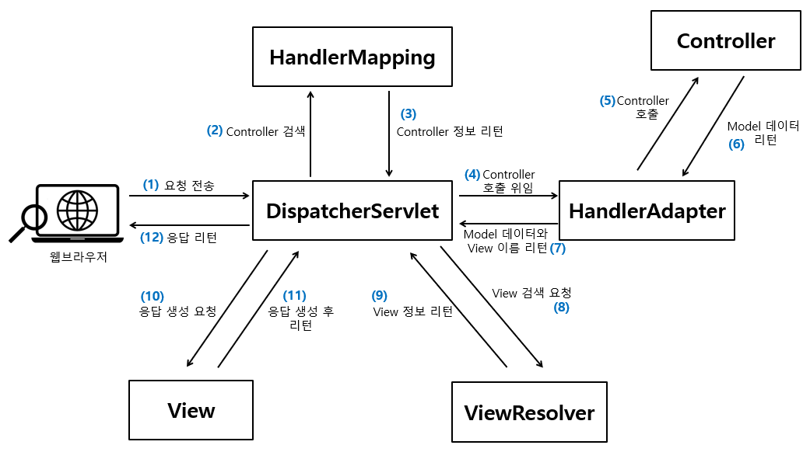

# [WEEK 06] 6주차 스프링을 사용하는 이유

## COW SPRING 4기 6주차 학습 과제

안녕하세요, 여러분!

중간고사 전에 Lotto 미션을 통해 객체지향 설계를 고민해보고 설계하는 방법에 대해 알아보았습니다.

이제 본격적으로 Spring 프레임워크에 대해 학습하고 이를 활용해보는 시간을 가지려 합니다.

이번 과제에서는 Spring 프레임워크가 무엇인지, 어떤 방식으로 작동하는지, 그리고 왜 사용하는지를 먼저 이해하는 것을 목표로 합니다.

Spring을 제대로 이해하고 활용하기 위해서는 기초 개념에 대한 탄탄한 지식이 필요하기 때문에, 이 부분을 중점적으로 학습해 주세요.

누군가에게는 이 키워드가 학습하기에 한 번에 쏙 이해가 안 될 수도 있습니다. 마찬가지로 1,2,3 기의 github 레포를 참고하셔도 좋습니다!

Spring 프레임워크를 통해 더 나은 객체지향 설계와 코딩을 할 수 있도록 여러분이 이해한 내용을 기반으로 앞으로의 미션을 수행하게 될 것입니다.

이번 과제를 통해 Spring의 기본 개념을 탄탄하게 하고, 다음 step으로 갈 수 있게 잘 정리해주세요!

---
> 아래의 필수 질문은 모든 분들이 정리하고 학습하셔야하는 내용입니다. 선택 질문은 원하시는 분들만 하시면 되지만 분명 학습하시면 큰 도움이 될 것들을 추려봤습니다!

# 필수

## 프레임워크란?
사전적으로는 "프로그래밍에서 특정 운영 체제를 위한 응용 프로그램 표준 구조를 구현하는 클래스와 라이브러리 모임"을 말한다. 프레임(틀, 규칙) + 워크(일, 소프트웨어의 목적),  즉  개발이나 소프트웨어의 규칙을 정하는 일이다.   
   
밀키트처럼 주어진 재료만 사용하면 요리를 완성할 수 있는 것처럼 목적에 따라 효율적으로 구조를 짜놓는 개발 방식이라고 할 수 있다.    
   
실제 개발환경에서는 개인이 아닌 공동으로 개발하는 경우가 많고, 개인마다 소스의 형태가 다르기 마련이다. 그러면 서로의 코드를 이해하는데 시간이 걸리고 역량에 따라 이해를 못하는 경우도 발생할 수 있다. 이런 문제를 해결하기 위해 개발 표준 가이드를 정의하고 표준에 맞춰 개발할 수 있도록 하는 것, 자주 사용되는 기능이나 사이트 전체와 관련된 기능을 공통으로 관리하여 재사용성을 높일 수 있도록 하는 것이다. 이런 개발환경을 만들어 주는 것이 프레임워크라고 할 수 있다.   
   
프레임워크를 사용하면 아무것도 없는 상태에서 코드를 하나씩 짜는 것보다 시간과 비용을 절약할 수 있어 생산성이 증가하고 버그 가능성을 처리하여 개발자가 반복 작업에서 실수하기 쉬운 부분을 커버해준다. 또한 담당자가 바뀌더라도 금방 이해할 수 있기 때문에 유지 보수에 안정적이라는 장점이 있다.   
   
프레임워크를 처음 공부할 때 염두에 두면 좋을 것들이 있다.
- 우선 프레임워크의 경우 순서대로 코드가 실행되지 않는다. 시작지점이 어딘지 찾는 것부터 헤맬 수 있기 때문에 프레임워크의 전체 동작방식을 이해할 필요가 있다.
- 프레임워크가 제공하는 도메인을 이해할 필요가 있다. 웹 프레임워크라면 HTTP,API, DB가 무엇인지 알고 있어야 하며 프론트엔드 프레임워크라면 HTML DOM이 무엇인지 알 필요가 있다.
- 프레임워크를 어떻게 사용하는지, 어떻게 구현하는지 알 필요가 있다. Spring이라면 필수 어노테이션을 알아야 하며 리액트라면 react hook들이 랜더링의 어떤 단계에서 실행되는지, state는 어떻게 관리하고 변경하는지 알아야 한다.   
   
스프링은 Bean Object를 관리해주는 프레임워크이다. 어노테이션이나 XML을 통해 각종 Bean(Component, Controller, Service 등)들을 정의하면 Bean을 생성하고, 해당 Bean을 사용하는 다른 Bean에게 의존성 주입을 수행한다.   
   
Spring MVC는 스프링을 이용하여 만든 웹 프레임워크이다. 각 부분과 동작 방식을 구현해 놓았고 스프링이 실행되어 MVC가 http요청을 처리하도록 각각의 부분을 주입해준다. 우리가 Controller, Service, Repository를 정의하여 도메인 처리 방식을 정의하면 MVC가 동작방식에 맞게 호출해준다. 

---

## 스프링의 장점 / 사용이유
<h3> 스프링 장점 </h3>

1. 모듈성과 유연성:Spring은 다양한 모듈로 구성되어 있어서 필요한 기능만 선택적으로 사용할 수 있음. 이는 개발자에게 모듈성과 유연성을 제공하며, 필요한 부분만 사용하여 불필요한 복잡성을 피할 수 있음.   
2. IoC (Inversion of Control) 컨테이너: Spring의 IoC 컨테이너는 객체의 생성, 관리, 의존성 주입을 처리하여 코드의 유지보수성과 테스트 용이성을 향상시킴. 개발자는 객체의 라이프사이클을 직접 관리하지 않아도 되므로 개발 생산성이 향상됨.
3. AOP (Aspect-Oriented Programming): Spring은 AOP를 지원하여 핵심 비즈니스 로직과는 별도로 관심사를 모듈화할 수 있음. 예를 들어, 로깅, 트랜잭션 관리, 보안 등과 같은 공통된 관심사를 별도의 모듈로 분리하여 코드의 중복을 방지하고 유지보수성을 향상시킴.
4. 데이터 액세스 및 트랜잭션 관리: Spring은 데이터베이스 액세스를 위한 강력한 기능을 제공함. JDBC와 ORM 프레임워크를 통한 데이터 액세스, 트랜잭션 관리를 간편하게 구현할 수 있음.
5. MVC 웹 프레임워크: Spring MVC는 모델-뷰-컨트롤러 아키텍처를 제공하여 웹 애플리케이션을 구조화하고 유지보수하기 쉽게 합니다. 또한, 다양한 확장 가능한 기능과 통합이 가능한 구조를 제공함.
6. 보안: Spring Security는 보안 관련 기능을 제공하여 사용자 인증, 권한 부여, 보안 설정을 쉽게 처리할 수 있음.
7. 테스트 용이성: Spring은 테스트 주도 개발(TDD)을 지원하며, 테스트하기 쉬운 코드를 작성할 수 있도록 도와줌. 테스트 환경을 설정하고 테스트하기 쉬운 코드를 작성하는 데 도움이 되는 다양한 도구를 제공함.
8. 커뮤니티와 생태계: Spring은 큰 커뮤니티와 다양한 생태계를 가지고 있어서 문제 해결, 정보 공유, 다양한 라이브러리 및 플러그인을 활용할 수 있음.   
   - 출처: https://perfect-dev.tistory.com/21 [To Be Develop:티스토리]

<h3> 사용이유 </h3>
사실상 위의 장점들 때문에 사용한다고 할 수 있다. 객체 지향적이고 모듈화된 코드 작성, 유연성 및 편리한 데이터 액세스, 트랜잭션 관리 등의 기능 지원으로 애플리케이션 개발이 더 효율적으로 진행되고, 유지모수가 용이해지기 때문이다.

---

## AOP란?
AOP(Aspect-Oriented Programming)는 프로그래밍 패러다임 중 하나로, 관심사의 분리(Concern Separation)를 위해 사용되는 기술이다. 애플리케이션의 핵심 비즈니스 로직과 관련 없는 부가적인 기능들을 모듈화하여 코드의 중복을 줄이고 유지보수성을 향상시키는 데에 주로 활용된다.   
   
여기서 관점이란, 어떤 기능을 구현할 때 그 기능을 핵심 기능과 부가 기능으로 구분하여 각각 하나의 관점으로 보는 것을 의미한다. (핵심 기능은 비즈니스 로직을 구현하는 과정에서 비즈니스 로직이 처리하는 목적 기능을 의미)
   
스프링에서는 일반적으로 사용하는 클래스인 Service, Dao 등에서 중복되는 공통 코드 부분(commit, rollback, log처리)을 별도의 영역으로 분리하고, 코드가 시행 되기 전이나 이후의 시점에 해당 코드를 붙여 넣어 소스 코드의 중복을 줄이고 필요할 때마다 가져다 쓸 수 있게 객체화하는 기술이다. 이때 사용되는 어노테이션에는 @Before, @After, @AfterReturning, @AfterThrowing, @Around 등이 있다.

---

## 싱글톤이란?
싱글톤 패턴은 객체 지향 프로그래밍에서 특정 클래스가 단 하나만의 인스턴스를 생성하여 사용하기 위한 패턴이다. 생성자를 여러 번 호출해도 인스턴스가 하나만 존재하도록 보장하여 애플리케이션에서 동일한 객체 인스턴스에 접근할 수 있도록 한다.   
   
커넥션 풀, 스레드 풀, 디바이스 설정 객체 등과 같은 경우 인스턴스를 여러 개 만들었을 때 불필요한 자원을 사용하고 프로그램이 예상치 못한 결과를 낳을 수 있다. 이런 경우에 단 한 번만 생성하여 전역에서 공유하고 사용할 수 있도록 싱글톤 패턴을 사용한다.   
   
싱글톤 패턴을 사용하면 메모리 절약, 지연 초기화, 유일한 인스턴스의 장점을 가지지만 구현 코드가 많이 들어가고, 의존관계상 클라이언트가 구체 클래스에 의존하여 DIP를 위반하며 OCP를 위반할 가능성도 있다. 또한 테스트마다 데이터를 초기화 해야하는 번거로움과 private 생성자로 자식 클래스를 만들기 어려워 유연성이 떨어진다.
   
싱글톤 패턴을 구현하기 위해서는 객체 생성을 위한 new 생성자에 제약을 걸고, 단일 객체를 반환할 수 있는 메소드가 필요하다. 아래 세 조건이 필수로 충족되어야 한다.
1. new 키워드를 사용할 수 없도록 생성자에 private 접근 제어자를 지정해야 한다.
2. 유일한 단일 객체를 반환할 수 있는 정적 메소드가 필요하다.
3. 유일한 단일 객체를 참조할 정적 참조 변수가 필요하다.
   
싱글톤 패턴은 공유 객체로 사용되기 때문에 상태 값을 가지지 않도록 하는 것이 좋다. 만일 상태가 변경된다면 모든 참조 변수에도 영향을 미치기 때문이다. 상태값이 아닌 읽기 전용 속성을 가지거나 다른 단일 객체를 참조하는 속성을 가지는 경우에는 문제되지 않는다. 또하 일반적인 싱글톤은 Thread Safe하지 않다. 이는 여러 스레드가 동시에 접근할 경우 문제가 생길 수 있다는 것이다. 이를 해결하기 위해서 synchronized 키워드를 사용하거나, 이른 초기화(eager initialization)를 사용하거나, 더블 체크 락(Double-Checked Locking)을 사용하거나, Bill Pugh Solution을 사용하거나, Enum을 사용하는 방법이 있다. 

---

## 싱글톤 컨테이너란?

스프링 컨테이너는 스프링의 핵심 컨테이너로, Bean의 생명주기를 관리하고 Bean들의 DI를 관리해주며 이 Bean들을 싱글톤으로 관리한다.
  
Bean은 스프링 컨테이너에 저장된 자바 객체를 말하며 결국 스프링 컨테이너에 자바 객체(Bean)가 등록되면 이 객체를 컨테이너가 싱글톤으로 관리하는 것이다.이 Bean들을 싱글톤으로 관리하는 스프링 컨테이너를 싱글톤 컨테이너라고 부르기도 한다.

---

## Spring에서 Bean 관리 방법
빈은 인스턴스화된 객체를 의미하며 스프링 컨테이너에 등록된 객체를 스프링 빈이라고 한다. new 키워드 대신 사용하는 것이라고 볼 수 있다고 한다. 스프링에서 빈을 사용하는 이유는 스프링 간 객체가 의존관계를 관리하도록 하는 것에 있다고 한다. 객체가 의존관계를 등록하면 스프링 컨테이너에서 해당하는 빈을 찾고 그 빈과 의존성을 만든다.
   
빈을 등록할 때에는 xml에 직접 등록하거나 @Bean을 사용하거나, @Componenet, @Controller, @Service, @Repository를 사용하는 방법이 있다.
   
빈의 라이프사이클은 5단계로 나타낼 수 있다.
1. 빈 인스턴스화 : 스프링 컨테이너가 빈을 생성한다.
2. 의존성 주입 : 빈의 의존성이 설정된다.
3. 빈 초기화 : 초기화 콜백 메소드가 호출되어 초기화 작업이 수행된다.
4. 빈 사용 : 애플리케이션에서 빈을 사용한다.
5. 빈 소멸  : 애플리케이션 종료 시 소멸 콜백 메소드가 호출되어 정리 작업이 수행된다.
---

## Layered Architecture
소프트웨어 아키텍처는 소프트웨어 시스템의 전체적인 구조와 구성요소들 간의 상호작용을 설계하는 것을 말한다. 건물의 뼈대를 잡는 것과 같은 과정인 것이다. 소프트웨어 아키텍처는 시스템의 전체적인 동작을 결정하고, 시스템의 품질과 성능에 직접적으로 영향을 준다. 선택을 할 때에는 요구사항, 복잡성, 기술 스택, 경험, 비용 및 시간 등의 요소들을 고려하여 적절한 패턴을 선택한다. 그 중 가장 기본적인, 표준인 아키텍처가 레이어드 아키텍처이다.
   
레이어드 아키텍처는 소프트웨어 시스템을 관심사 별로 여러 개의 계층으로 분리한 아키텍처를 말한다. 이때 관심사에 따라 계층을 나누는 것을 계층화라고 한다. 각 계층은 관심사가 분리되어 어플리케이션 내에서 특정 역할과 책임이 있고, 각자 자신의 역할에만 집중한다. 서로 추상화된 인터페이스로만 소통을 하며, 이 소통은 자신보다 상위인 계층이나 인접하지 않은 계층에는 요청을하지 못하고 인접한 하위 계층에 요청을 보내는 방식으로 진행된다. 여기서 주목할 것은 단발성 의존성이다. 하위 계층은 상위 계층을 몰라야 하며 하위 계층은 인터페이스만 제공하여 요청만 받는다.
   
가장 일반적인 레이어드 아키텍처는 4-tier 아키텍처(프레젠테이션, 비즈니스, 영속성, 데이터베이스 순서로 구성됨)이다.
- 프레젠테이션 레이어:    
   
사용자나 클라이언트 시스템과 직접적으로 연결되는 부분, 비즈니스 로직 등은 이 계층의 관심사가 아니다.
- 비즈니스 레이어:
   
비즈니스 로직을 구현하는 부분으로, 실제로 시스템을 구현해야 하는 핵심 로직을 담당. 프레젠테이션 레이어로부터 사용자의 요청을 전달받고 그 요청을 실질적으로 처리한다.
- 영속성 레이어: 
   
데이터의 영구 저장과 관리를 담당. 웹 어플리케이션의 데이터베이스와의 상호작용을 처리하고, 데이터베이스와의 상호작용을 추상화한다.
- 데이터베이스: 
   
실제 데이터베이스를 의미한다.

레이어드 아키텍처에서는 "CLOSED"의 개념이 중요하다. Closed는 계층 간에 요청이 이동을 할 때 인접한 계층을 통과해야하는 것을 의미한다. 만일 계층을 뛰어넘어 다른 계층으로 바로 이동한다면 속도면에서는 엄청나게 빠를 수 있지만 관심사가 분리되지 않은 형태라는 것이 문제이다. 우리가 관심사를 분리하여 다른 계층의 영향을 받지 않는 독립적인 계층을 만들려는 이유는 한 계층에서 변경이 발생되었을 때 다른 계층에 영향을 주거나 받지 않기 위해서이다.
   
항상 계층이 닫혀있기만 한 것은 아니다. 특정 기능에서만 사용하기 위한 계층을 따로 만들었을 때 요청이 이 계층을 거치지 않고 바로 다음 계층으로 이동하도록 하는 것이 "OPEN"이다. 레이어 아키텍처에서는 계층 구조와 요청 흐름을 문서화하여 어떤 계층이 열려있고 닫혀있는지를 나타내고 그 이유를 적절히 전달해야 한다.
   
레이어드 아키텍처는 관심사별로 계층이 분리되어 있어 코드의 재사용성과 유지보수성을 향상시키며 각 계층이 독립적으로 변화 가능하다. 또한 테스트도 독립적으로 가능하다는 특징이 있다. 다만 계층간 통신을 통해 동작ㅎ하여 데이터의 전달 및 변환 과정에서 오버헤드가 발생하기도 한다. 이는 계층이 많아질 수록 더 증가한다. 그리고 통신을 위한 인터페이스와 로직을 추가해야하기 때문에 복잡성이 증가한다는 단점이 있다.

---

## 스프링 어노테이션란? / 어노테이션 종류 10가지 이상 찾아보기
어노테이션은 자바 클래스, 메소드 및 필드에 추가하여 동작 및 목적에 대한 추가 정보를 제공할 수 있는 특수 마커를 의미한다. 종속성 주입, 트랜잭션 관리, 웹 어플리케이션 개발과 같은 응용 프로그램의 다양한 관점을 구성하는 데 사용할 수 있다.
   
대표적으로 @Component, @Autowired, @RequestMapping, @Transactional, @Value등이 사용된다.

@Component는 클래스를 스프링 컨테이너에서 자동으로 감지하고 인스턴스화할 수 있는 스프링 구성 요소로 표시한다. @Component 어노테이션은 @Repository, @Service 및 @Controller 어노테이션의 메타 어노테이션이다.
   
@Autowired는 스프링에서 빈에 의존성 주입을 수행하는 데 사용되는 어노테이션이다. @Autowired 어노테이션은 생성자, 필드 또는 메소드에 적용할 수 있다.
   
@RequestMapping은 요청 URL을 어떤 메소드가 처리할지 매핑해준다.
   
@Transactional은 트랜잭션을 관리하는 데 사용되는 어노테이션이다. 메소드 또느 클래스에 대한 트랜잭션 경계를 정의한다.
   
@Value는 속성 파일 또는 환경 변수의 값을 스프링 빈에 삽입한다.
   
이러한 어노테이션들을 사용하려면 프로젝트의 클래스 경로에 스프링 프레임워크 종속성을 추가해야 한다. 메이븐 프로젝트의 경우 pom.xml, Gradle 프로젝트의 경우 build.gradle과 같이 프로젝트의 빌드 파일에 필요한 종속성을 포함하여 작업을 수행할 수 있다.
   
그 다음에는 간략히 나타내면, 어노테이션 처리를 활성화하고, 코드에 어노테이션을 추가한 뒤 응용프로그램을 빌드하고 실행하면 된다.
   
어노테이션을 사용할 때 알아두면 좋을 것들이 있다. 일단 어노테이션을 잘 사용하면 강력한 도구가 될 수 있지만 남용을 할 경우 읽기 어려워질 수 있고, 불필요한 종속성과 결합을 만들 수 있다. 어노테이션이 달린 클래슨 메소드에 설명 이름을 사용하는 것이 구성 요소의 목적과 동작을 더 쉽게 이해하는 데 도움을 줄 수 있다. 어노테이션 특성에 표준 명명 규칙을 사용하는 것이 좋다. 사용자 지정 어노테이션을 정의하거나 속성을 사용할 때는 속성 이름에 카멜표기법을 사용하고 단일 값 속석에 값으로 접두사를 붙이는 등의 규칙을 따르는 것이 좋다. 이 밖에도 특정 사용 사례에 적합한 어노테이션을 사용하고, 구성요소 검색에 스프링 스테리오 타입 어노테이션 사용, 어노테이션 메타 데이터를 체계적으로 유지, 어노테이션의 사용을 문서화하는 것 등이 있다.
   
추가로 어노테이션을 더 정리해보았다.
   
@ComponentScan: @Component, @Service, @Repository, @Controller 어노테이션이 붙은 클래스를 찾아 스프링 빈으로 등록한다.
   
@Bean: 개발자가 직접 제어가 불가능한 외부 라이브러리 등을 빈으로 만들 때 사용한다.

@Controller: 스프링의 컨트롤러를 의미하며 Spring MVC에서 Controller 클래스에 사용된다.
   
@RestController: 스프링에서 컨트롤러 중 뷰로 응답하지 않는 컨트롤러를 의미한다. 메소드의 반환 결과를 JSON 형태로 반환한다. @Controller와 @ResponseBody를 합친 것이다.
   
@Service: 비즈니스 로직을 처리하는 클래스에 사용한다.
   
@Repository: DAO 클래스에 사용한다. 데이터베이스에 접근하는 메소드를 가진 클래스에서 쓰인다.
   
@Valid: 유효성 검증이 필요한 객체임을 지정한다.

---

# 선택

## Spring Framework 구조와 동작 방식

keywords : Dispatcher Servlet, interceptor, handler

스프링 프레임워크의 구성요소에 대한 정리는 다음과 같다. (정확히는 스프링 MVC의 구조라고 해야할 것 같다.)

- ServletContainer
  -   클라이언트로부터 HTTP 요청을 받아 서블릿 로직을 처리할 수 있는 요소이다. 서블릿이란 javax.servlet 패키지에 정의된 인터페이스로, 자바 클래스 파일로 된 서버로직이다. 대표적으로 톰캣이 있다.
   

- DispatcherServlet
  - 애플리케이션으로 들어오는 모든 요청을 받는 부분으로, 요청을 실제로 처리할 컨트롤러에게 요청을 전달하고 그 결과값을 받아서 View에 전달하여 적절한 응답을 생성할 수 있도록 흐름을 제어한다.

- HandlerMapping
  - 스프링 프레임워크에 작성된 여러 컨트롤러 중에서 Request URL에 따라 로직을 수행할 컨트롤러를 확인해주는 컴포넌트이다.
   
- Controller
  - 개발자가 직접 개발하는 컴포넌트로, Request를 직접 처리한 후 그 결과를 다시 DispatchServlet에게 돌려주는 역할을 한다.
   
- Service
  - 개발자가 직접 개발하는 컴포넌트로, 비즈니스 로직을 수행하는 컴포넌트이다.
   
- DAO(Data Access Object)
  - 개발자가 직접 개발하는 컴포넌트로, 데이터베이스에 직접적으로 접근하는 객체이다. 주로 mybatis같은 persistence framework를 많이 활용한다.
   
- ViewResolver
  - ViewName을 기반으로 어떤 View 파일을 사용할 것인지 확인해주는 컴포넌트이다.

- View
  - 개발자가 직접 개발하는 컴포넌트로, 보통 UI 화면을 의미한다. 

Spring MVC의 전체적인 동작원리는 다음과 같다.
1. 클라이언트가 요청을 전송하면 DispatcherServlet이라는 클래스에 요청 전달
2. DispatcherServlet은 클라이언트의 요청을 처리할 Controller에 대한 검색을 HandlerMapping 인터페이스에게 요청
3. HandlerMapping은 클라이언트 요청과 매핑되는 핸들러 객체를 다시 DispatcherServlet에게 리턴함 (핸들러 객체는 해당 핸들러의 Handler 메소드 정보를 포함하고 있음. Handler 메소드는 Controller 클래스 안에 구현된 요청 처리 메소드를 의미함)
4. 요청을 처리할 Controller 클래스를 찾은 뒤 실제로 클라이언트 요청을 처리할 Handler 메소드를 찾아 호출하는데, DispatcherServlet은 Handler 메소드를 직접 호출하지 않고 HandlerAdapter에게 Handler 메소드 호출을 위임함
5. HandlerAdapter는 DispatcherServlet으로부터 전달받은 Controller 정보를 기반으로 해당 Controller의 Handler 메소드를 호출
6. Controller의 Handler 메소드는 비즈니스 로직 처리 후 리턴 받은 Model 데이터를 HandlerAdapter에게 전달
7. HandlerAdapter는 전달받은 Model 데이터와 View 정ㅂ를 ㄷ시 DispatcherServlet에게 전달 (HandlerAdapter는 어떤 리턴 타입이든 모두 ModelAndView로 반환함)
8. DispatcherServlet은 전달받은 View 정보를 다시 ViewResolver에게 전달하여 View 검색 요청
9. ViewResolver는 View 정보에 해당하는 View를 찾아서 View를 다시 리턴함
10. DispatcherServlet은 ViewResolver로부터 전달받은 View 객체를 통해 Model 데이터를 넘겨주면서 클라이언트에게 전달할 응답 데이터 생성을 요청
11. View는 응답 데이터를 생성해서 다시 DispatcerServlet에게 전달
12. DispatcherServlet은 전달받은 응답 데이터를 최종적으로 클라이언트에게 전달
   

---
