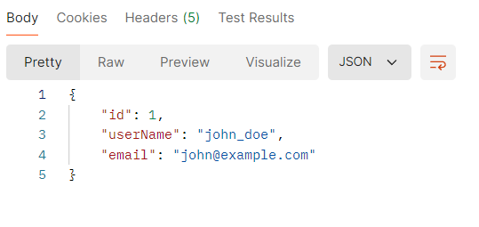
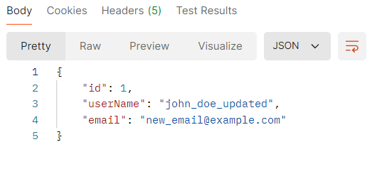
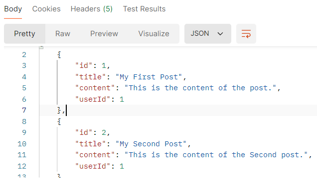
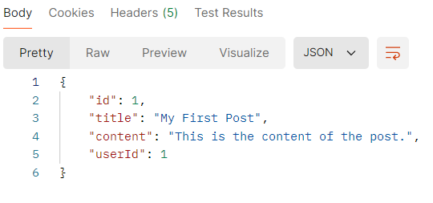
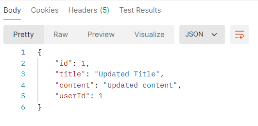

# 필수

## 프레임워크란?

프레임워크란, 소프트웨어 어플리케이션이나 솔루션의 개발을 수월하게 하기 위해 소프트웨어의 구체적 기능들에 해당하는 부분의 설계와 구현을 재사용 가능하도록 협업화된 형태로 제공하는 소프트웨어 환경을 말한다.

즉, 소프트웨어 개발에 필수적이고 표준적인 부분에 해당하는 설계와 구현을 재사용 가능하도록 일련의 협업화된 클래스들로 제공하는 반제품 소프트웨어 모듈이라고 할 수 있다.

지원 프로그램, 컴파일러, 코드 라이브러리, 도구 세트, API 등을 제공한다.

코드를 재사용 가능한 형태로 구조화한다는 점에서 라이브러리와 비슷하지만, 라이브러리에서는 호출 측이 전체 프로그램 제어 구조를 지정할 수 없는 반면 프레임워크에서는 이러한 제어의 반전이 가능하다.

---

## 스프링의 장점 / 사용이유

Spring이란, 자바 언어를 기반으로 만들어진 웹 애플리케이션을 의미한다. 객체지향 설계 원칙인 IoC, DI, AOP 등을 적용하였으며 이를통해 유연하고 유지보수가 쉬운 애플리케이션 구조를 제공한다.

스프링을 사용 했을 때 대표적으로 이러한 장점들이 있다.
1. POJO 프로그래밍에 기반하여 구성할 수 있다. 이를 통해 자유롭게 객체지향적 설계를 꾀할 수 있다.
2. DI를 통해 객체 관계를 구성할 수 있다.
3. AOP 지원 (후술)

결국 스프링에서 제공하는 기능들이 비즈니스 로직에 집중할 수 있고 더 편리한 개발을 도모할 수 있도록 하기에 사용하는 것이다.
또한 개발자가 기본적인 디자인 패턴을 사용하게 함으로서 코드의 최소한의 퀄리티를 보장한다는 장점또한 있다.

---

## AOP란?

AOP(Aspect Oriented Programming, 관점 지향 프로그래밍)란 어떤 로직을 기준으로 핵심적인 관점, 부가적인 관점을 나누어 그 관점을 기준으로 모듈화하는 프로그래밍 방식이다.

어플리케이션에서 반복 사용되는 코드를 모듈화하고 비즈니스 로직(핵심적인 관점)에서 분리하여 재사용하는 것이 핵심 포인트이다.

---

## 싱글톤이란?

싱글톤(Singleton)이란, 객체 지향 프로그래밍에서 특정 클래스가 단 하나의 인스턴스만을 생성해 사용하는 패턴이다. 생성자를 여러번 호출하더라도 인스턴스가 하나만 존재하도록 해 애플리케이션에서 동일한 객체 인스턴스에 접근할 수 있도록 한다.

인스턴스를 여러 개 만들게 되면 불필요한 자원을 사용하게 되어 의도한 바와 다른 결과물이 출력될 수 있다. 따라서 객체를 한 번만 생성해 공유하여 사용하기 위해 싱글톤 패턴을 사용한다.

싱글톤 패턴을 사용함으로서 이러한 이점을 얻을 수 있다.
1. 유일한 인스턴스를 통해 객체를 일관된 상태로 유지가능하다.
2. 인스턴스가 하나뿐이므로 메모리를 절약할 수 있고 오버헤드를 줄일 수 있다.

하지만 단점도 존재하는데,
1. 유일한 인스턴스에 의존하는 경우 결합도가 증가할 수 있다.
2. 만약 싱글톤 클래스가 상태를 가지고 있는 경우 전역에서 사용되기 때문에 예상치 못한 동작이 발생할 수 있다.
3. 인스턴스의 무분별한 사용으로 인한 복잡성이 증가할 수 있다.

싱글톤 패턴은 웹 애플리케이션에 많이 사용한다고 한다.
보통 웹 애플리케이션은 여러 클라이언트가 동시다발적으로 요청을 하다보니 하나의 객체를 만들고 공유하는 방식으로 구현해 메모리 낭비를 줄인다고 한다.

---

## 싱글톤 컨테이너란?

싱글톤 패턴의 문제점을 해결하면서도 객체 인스턴스를 싱글톤으로 관리한다.
싱글톤 컨테이너는 key와 value의 쌍으로 각각 1개의 key에 대해 하나의 객체 레퍼런스를 가지고 있다. 이렇게 싱글톤으로 구현이 되어있고 싱글톤 객체를 생성하고 관리하는 기능을 싱글톤 레지스트리라고 한다.

---

## Spring에서 Bean 관리 방법

Spring Bean은 Spring IoC 컨테이너가 관리하는 자바 객체로서 컨테이너에 의해 생명주기가 관리되는 객체를 의미한다.
따라서 필요할 때 마다 IoC 컨테이너에서 가져와서 사용한다.

어노테이션인 @Bean을 사용하거나 xml 설정을 통해 일반 객체를 Bean으로 등록할 수 있다.

```
<!-- 간단한 빈 정의 -->
<bean id="..." class="..."></bean>

<!-- scope와 함께 빈 정의 -->
<bean id="..." class="..." scope="singleton"></bean>

<!-- property와 함께 빈 정의 -->
<bean id="..." class="...">
	<property name="beaninit" value="Hello World!"/>
</bean>

<!-- 초기와 메소드와 함께 빈 정의 -->
<bean id="..." class="..." init-method="..."></bean>
```

객체 생성 -> 의존 설정 -> 초기화 -> 사용 -> 소멸 과정의 생명 주기를 가지고 있다.

1. Bean은 스프링 컨테이너에 의해 생명주기를 관리한다.
2. 스프링 컨테이너가 초기화될 때 먼저 빈 객체를 설정에 맞춰 생성하며 의존 관계를 설정한 뒤 프로세스가 완료되면 빈 객체가 지정한 메소드를 호출해 초기화를 진행한다.
3. 객체를 사용해 컨테이너가 종료될 때 빈이 지정한 메소드를 호출해 소멸 단계를 거친다.
4. 스프링은 InitializingBean 인터페이스와 DisposableBean을 제공하며 빈 객체의 클래스가 InitializingBean Interface 또는 DisposableBean을 구현하고 있으며 해당 인터페이스에서 정의된 메소드를 호출해 빈 객체의 초기화 또는 종료를 수행한다. 또한 어노테이션을 이용한 빈 초기화 방법에는 @PostConstruct와 빈 소멸에서는 @PreDestory를 사용한다.

---

## Layered Architecture

복잡한 시스템을 계층 구조로 구성하여 구현하는 방법. 시스템을 여러 개의 계층으로 분리하고 각 계층이 서로 독립적으로 동작하며 상위 계층에서 하위 계층으로의 의존만 존재하는 형태이다.

Layered Architecture는 각 구성 요소(계층)들이 책임을 기준으로 분리되어 있으며, 각 계층 간의 명확한 역할 분담을 통해 높은 유지보수성과 확장성을 가진다.


---

## 스프링 어노테이션이란? / 어노테이션 종류 10가지 이상 찾아보기

어노테이션이란, 메타데이터를 제공하는 일종의 주석으로 코드 사이에 쓰이며 주로 컴파일러에게 정보 제공, 런타임시 특정 동작 제어 등을 수행하도록 하는 기술이다.


어노테이션의 종류
1. @Override
   부모 클래스에서 상속받은 메서드를 재정의(Override)할 때 사용한다. 컴파일러가 해당 메서드가 부모 클래스에 존재하는지 여부를 확인하도록 한다.
2. @Deprecated
   더 이상 사용되지 않는 코드(메서드, 클래스 등)에 사용한다. 컴파일러는 이 어노테이션이 붙은 코드를 사용할 경우 경고 메시지를 띄운다.
3. @SuppressWarnings
   컴파일러의 특정 경고를 무시하고 싶을 때 사용한다. @SuppressWarnings("unchecked")와 같이 사용한다.
4. @SafeVarargs
   제네릭 가변 인수 메서드에서 타입 안전성을 보장하는 경우 사용한다. 가변 인수의 타입 안전성 문제를 해결하기 위해 주로 사용된다.
5. @FunctionalInterface
   함수형 인터페이스임을 명시하는 어노테이션이다. 함수형 인터페이스는 오직 하나의 추상 메서드를 갖는 인터페이스를 의미한다.
6. @Retention
   어노테이션의 유지 기간을 지정하는 어노테이션이다. 값으로 RetentionPolicy.SOURCE, RetentionPolicy.CLASS, RetentionPolicy.RUNTIME 등을 사용해 지정한다.
7. @Target
   어노테이션이 적용될 수 있는 위치를 지정한다. 값으로 ElementType.METHOD, ElementType.FIELD, ElementType.TYPE 등을 사용해 지정한다.
8. @Inherited
   클래스에서 상속 가능한 어노테이션을 지정한다. 부모 클래스에 적용된 어노테이션이 자식 클래스에도 상속되도록 한다.
9. @Documented
   어노테이션이 Javadoc 같은 문서화 도구에서 문서화될 수 있도록 지정한다. 문서 생성 시 어노테이션에 대한 정보도 포함된다.
10. @Repeatable
    동일한 어노테이션을 여러 번 적용할 수 있게 해주는 어노테이션이다. 이를 통해 한 위치에 여러 번 어노테이션을 사용할 수 있다.

---

# 7주차 학습 내용 (CRUD API 연습)

## 이론
- REST API
- REST API 설계 주의 점(동사를 써도 되는 경우)
- HTTP 특징
- HTTP 메소드 8가지
- DB
   - 정규화 3단계
   - 1 : 1
   - 1 : M
   - M : M
   - PK, FK

## 1. **User 엔터티 관련 API**

### 1.1 회원 가입

- **URL**: http://localhost:8080/members
- **설명**: 새로운 사용자를 등록합니다.
- **Request Body**:

    ```json
    
    {
      "username": "john_doe",
      "email": "john@example.com",
      "password": "password123"
    }
    
    ```


### 1.2 사용자 정보 조회

- **URL**: http://localhost:8080/members/{name}
- **설명**: 특정 사용자 정보를 조회합니다.
- **Response 예시**:

    ```json
    
    {
      "id": 1,
      "username": "john_doe",
      "email": "john@example.com"
    }
    
    ```




### 1.3 사용자 정보 업데이트

- **URL**: http://localhost:8080/members/{name}
- **설명**: 특정 사용자의 프로필 정보를 업데이트합니다.
- **Request Body**:

    ```json
    
    {
      "username": "john_doe_updated",
      "email": "new_email@example.com"
    }
    
    ```




### 1.4 사용자 삭제

- **URL**: http://localhost:8080/members{name}
- **설명**: 특정 사용자를 삭제합니다.

---

## 2. **Post 엔터티 관련 API**

### 2.1 게시글 작성

- **URL**: http://localhost:8080/posts
- **설명**: 새로운 게시글을 작성합니다.
- **Request Body**:

    ```json
    
    {
      "title": "My First Post",
      "content": "This is the content of the post.",
      "userId": 1
    }
    
    ```


### 2.2 게시글 목록 조회

- **URL**: http://localhost:8080/posts
- **설명**: 모든 게시글 목록을 조회합니다.
- **Response 예시**:

    ```json
    
    [
      {
        "id": 1,
        "title": "My First Post",
        "content": "This is the content of the post.",
        "userId": 1
      },
      {
        "id": 2,
        "title": "Another Post",
        "content": "Some other content.",
        "userId": 2
      }
    ]
    
    ```



### 2.3 특정 게시글 조회

- **URL**: http://localhost:8080/posts/{id}
- **설명**: 특정 게시글을 조회합니다.
- **Response 예시**:

    ```json
    
    {
      "id": 1,
      "title": "My First Post",
      "content": "This is the content of the post.",
      "userId": 1
    }
    
    ```



### 2.4 게시글 수정

- **URL**: http://localhost:8080/posts/{id}
- **설명**: 특정 게시글의 내용을 수정합니다.
- **Request Body**:

    ```json
    
    {
      "title": "Updated Title",
      "content": "Updated content"
    }
    
    ```



### 2.5 게시글 삭제

- **URL**: http://localhost:8080/posts/{id}
- **설명**: 특정 게시글을 삭제합니다.

---